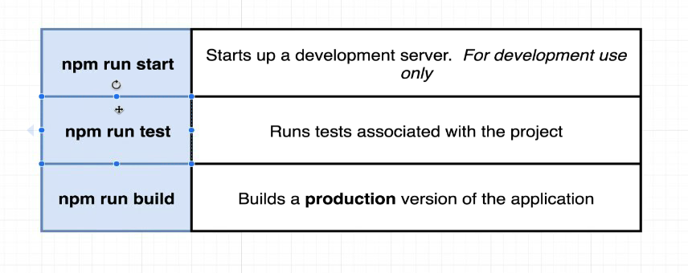
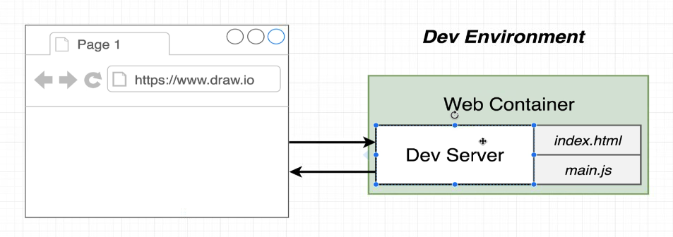
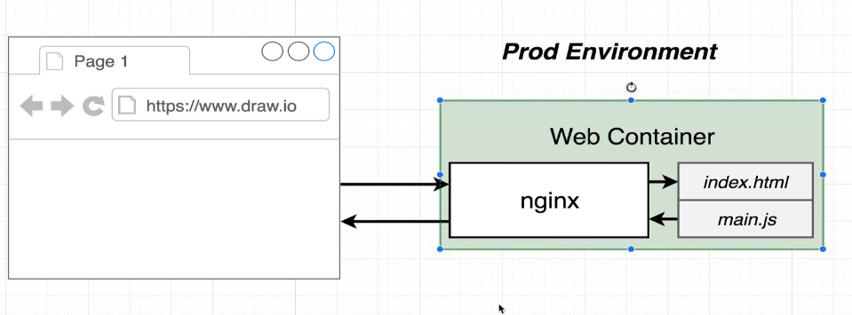

## What are different volumes available in Docker and how to use them ?

### Docker Volumes: Quick Reference

#### What are Docker Volumes?
Volumes are used in Docker to persist data generated by and used by containers. They help keep data outside the container’s filesystem, allowing data to persist even if the container is removed or updated.

#### Types of Volumes
1. **Named Volumes:**
   - Managed by Docker.
   - Stored in Docker's directory (e.g., `/var/lib/docker/volumes/`).

2. **Bind Mounts:**
   - Host directories or files mounted into a container at a specified path.
   - Provide more control over data location on the host.

#### When to Use Volumes
1. **Data Persistence:** Ensure data is retained across container restarts and removals.
2. **Sharing Data:** Share data between multiple containers.
3. **Development:** Synchronize code or config changes between host and container.
4. **Backups:** Store important data on the host for backup purposes.

#### Basic Commands
1. **Create a Named Volume:**
   ```sh
   docker volume create my_volume
   ```

2. **Run a Container with a Named Volume:**
   ```sh
   docker run -d -v my_volume:/data my_image
   ```

3. **Run a Container with a Bind Mount:**
   ```sh
   docker run -d -v /path/on/host:/path/in/container my_image
   ```

4. **List Volumes:**
   ```sh
   docker volume ls
   ```

5. **Inspect a Volume:**
   ```sh
   docker volume inspect my_volume
   ```

6. **Remove a Volume:**
   ```sh
   docker volume rm my_volume
   ```

7. **Prune Unused Volumes:**
   ```sh
   docker volume prune
   ```

#### Example in Docker Compose
```yaml
version: '3.8'
services:
  web:
    image: my_web_app
    volumes:
      - my_named_volume:/data
      - ./local_directory:/app
    ports:
      - "8080:80"

volumes:
  my_named_volume:
```

- **Named Volume:** `my_named_volume` is mounted to `/data` inside the container.
- **Bind Mount:** `./local_directory` on the host is mounted to `/app` inside the container.

### Key Points
- **Named Volumes:** Ideal for persistent, Docker-managed data storage.
- **Bind Mounts:** Useful for development and host-specific data needs.
- **Command Usage:** Use `-v` option with `docker run` to mount volumes.

---
# How to use a custome Dockerfile such as Dockerfile.dev in docker-compose.yml?

### Using `Dockerfile.dev` in Docker Compose

To use a custom Dockerfile, such as `Dockerfile.dev`, in your Docker Compose setup, you need to specify the `dockerfile` key in your `docker-compose.yml` file. This allows you to use a different Dockerfile for building your images during development.

Here’s a step-by-step guide on how to achieve this:

### Step 1: Create `Dockerfile.dev`
Create a `Dockerfile.dev` in your project directory with the necessary instructions for your development environment.

**Example `Dockerfile.dev`:**
```Dockerfile
FROM node:14

# Set working directory
WORKDIR /app

# Install dependencies
COPY package*.json ./
RUN npm install

# Copy source files
COPY . .

# Expose port and start application
EXPOSE 3000
CMD ["npm", "start"]
```

### Step 2: Modify `docker-compose.yml`
Modify your `docker-compose.yml` to use `Dockerfile.dev` for the relevant service.

**Example `docker-compose.yml`:**
```yaml
version: '3.8'

services:
  web:
    build:
      context: .
      dockerfile: Dockerfile.dev
    ports:
      - "3000:3000"
    volumes:
      - .:/app
      - /app/node_modules
    environment:
      - NODE_ENV=development
```

### Explanation:
- **build.context**: Sets the build context to the current directory.
- **build.dockerfile**: Specifies `Dockerfile.dev` as the Dockerfile to use.
- **ports**: Maps port 3000 on the host to port 3000 in the container.
- **volumes**:
  - `.:/app`: Mounts the current directory to `/app` in the container.
  - `/app/node_modules`: Prevents overwriting of `node_modules` in the container with an empty `node_modules` directory from the host.
- **environment**: Sets environment variables, such as `NODE_ENV=development`.

### Step 3: Run Docker Compose
Use Docker Compose to build and run the services defined in `docker-compose.yml`.

```sh
docker-compose up --build
```

This command will build the images using `Dockerfile.dev` and start the containers.

### Additional Tips:
- **Rebuild without cache:** If you need to rebuild the image without using the cache, you can use the `--no-cache` option:

  ```sh
  docker-compose build --no-cache
  ```

- **Detached mode:** To run the services in detached mode, add the `-d` flag:

  ```sh
  docker-compose up -d
  ```

### Summary:
Using a `Dockerfile.dev` inside `docker-compose.yml` allows you to customize the build process for your development environment. By specifying the `dockerfile` key, you can easily switch between different Dockerfiles for different stages of your project, such as development, testing, and production. This approach keeps your configurations clean and organized, enhancing the flexibility and maintainability of your Docker setup.

---
##  How to test using a separate service using docker compose?

### Creating a Separate Service for Testing in Docker Compose

To create a separate service specifically for testing your web app in Docker Compose, you can define an additional service in your `docker-compose.yml` file. This testing service can have its own configuration and dependencies, tailored for running tests.

### Example: Node.js Application

Here's an example `docker-compose.yml` file that includes a separate service for testing a Node.js web application:

**`docker-compose.yml`:**
```yaml
version: '3.8'

services:
  web:
    build:
      context: .
      dockerfile: Dockerfile
    ports:
      - "3000:3000"
    volumes:
      - .:/app
      - /app/node_modules
    environment:
      - NODE_ENV=development

  test:
    build:
      context: .
      dockerfile: Dockerfile.test
    volumes:
      - .:/app
      - /app/node_modules
    environment:
      - NODE_ENV=test
    command: npm test # Replace with the appropriate testing command for your app
    # Note: No ports are specified for the test service
```

**Example `Dockerfile.test`:**
```Dockerfile
FROM node:14

# Set working directory
WORKDIR /app

# Install dependencies
COPY package*.json ./
RUN npm install

# Copy source files
COPY . .

# Set the command to run tests
CMD ["npm", "test"]
```

### Running the Test Service

To run the test service defined in your `docker-compose.yml` file, use the following command:

```sh
docker-compose up test
```

This command will build the test service using `Dockerfile.test` and execute the `npm test` command.

### Highlight: No Port Binding for Test Service

In the example above, the test service does not specify any `ports` configuration. This means that no ports are exposed or mapped to the host, which is usually not necessary for testing purposes and helps avoid potential conflicts with other services running on the host.

### Conclusion

Creating a separate service for testing your web application in Docker Compose is a powerful approach to ensure consistency and isolation in your testing environment. By defining a dedicated service for testing, you can run tests in an environment that closely mirrors production, reducing the risk of issues caused by environmental differences. Additionally, not binding ports for the test service avoids unnecessary port conflicts and simplifies the setup. However, this approach also introduces additional complexity and resource requirements, which need to be managed appropriately.

---

## What is docker attach and why is it not recommended for interactive shells?

### `docker attach` Command

- **Purpose:** Connect terminal's STDIN/STDOUT/STDERR to a running container.
- **Syntax:** `docker attach <container_id_or_name>`

### Limitations of `docker attach` for Interactive Testing

1. **No New Shell:** Does not start a new shell session; attaches to the existing process.
2. **No TTY Allocation:** Requires TTY for interactive commands; `docker attach` doesn’t allocate a TTY.
3. **Single Stream Attachment:** Limited to the container’s current input/output streams.
4. **Process Constraints:** Depends on the container's process handling interactive input.

### Alternative: `docker exec` for Interactivity

- **Purpose:** Run commands in a running container with a new shell session and TTY.
- **Syntax:** `docker exec -it <container_id_or_name> <command>`
  - `-i`: Keep STDIN open.
  - `-t`: Allocate a TTY.

### Example for Running Tests

```sh
docker exec -it <container_id_or_name> npm test
```

### Summary

- **Use `docker attach`** for monitoring/logging.
- **Use `docker exec -it`** for interactive commands and testing suites.

---

## Why is a production server like Nginx is required in production?

### Explanation of Nginx in Production vs. Development Setup
  
  


#### Development Environment (Dev Environment)

- **Command:** `npm run start`
  - **Purpose:** Starts a development server.
  - **Usage:** For development use only.
  
  
- **Setup:**
  - **Dev Server:** Directly serves the application, handling both dynamic requests (like API calls) and static content (like `index.html` and `main.js`).
  - **Advantages:**
    - **Hot Reloading:** Automatically reloads the application when code changes, which is essential for rapid development and testing.
    - **Simplified Workflow:** Developers can run and test their code quickly without needing an additional server layer.

#### Production Environment (Prod Environment)

- **Command:** `npm run build`
  - **Purpose:** Builds a production version of the application.
    
      

- **Setup:**
  - **Nginx Server:** Acts as a reverse proxy and static content server.
  - **Advantages:**
    - **Performance:** Efficiently serves static files with high performance, handling a large number of simultaneous connections.
    - **Security:** Provides additional security features such as SSL termination and request filtering.
    - **Scalability:** Can load balance traffic across multiple instances of the application, ensuring high availability and reliability.
    - **Caching:** Implements caching mechanisms to improve load times and reduce server load.
    - **Static Content Serving:** Offloads the serving of static files from the application server, allowing it to focus on dynamic content and API responses.

### Summary

- **Nginx in Production:**
  - Provides enhanced performance, security, and scalability.
  - Efficiently serves static content and manages traffic.

- **No Nginx in Development:**
  - Focuses on rapid development and testing with features like hot reloading.
  - Simplifies the setup by running the application server directly.
  
  ---

## What are multistep builds in docker and why are they needed? Given an example of a node and nginx multistep build.

### Multistage Builds in Docker

**Multistage builds** allow you to use multiple `FROM` statements in a Dockerfile, enabling you to create more efficient and smaller Docker images. They are useful for separating the build environment from the runtime environment, thus optimizing the final image.

### Why Multistage Builds are Needed

1. **Smaller Image Size:**
   - By copying only the necessary artifacts from the build stage to the final stage, you avoid including unnecessary build dependencies, resulting in a smaller image.

2. **Improved Security:**
   - The final image contains only the runtime dependencies, reducing the attack surface by excluding build tools and other intermediate files.

3. **Simplified Builds:**
   - You can use different base images for different stages of the build process, making it easier to use the right tools for each step.

### Example: Node.js and Nginx Multistage Build

**Objective:** Build a Node.js application and serve it using Nginx.

**Dockerfile:**

```Dockerfile
# Stage 1: Build the Node.js application
FROM node:14 AS builder

# Set working directory
WORKDIR /app

# Copy package.json and package-lock.json
COPY package*.json ./

# Install dependencies
RUN npm install

# Copy the rest of the application code
COPY . .

# Build the application (assuming a build script is defined in package.json)
RUN npm run build

# Stage 2: Create the production image with Nginx
FROM nginx:alpine

# Copy the build output from the previous stage to Nginx's html directory
COPY --from=builder /app/build /usr/share/nginx/html

# Copy custom Nginx configuration if needed
COPY nginx.conf /etc/nginx/nginx.conf

# Expose port 80
EXPOSE 80

# Start Nginx
CMD ["nginx", "-g", "daemon off;"]
```

**Explanation:**

1. **Stage 1: Build the Node.js Application**
   - **Base Image:** `node:14`
   - **Steps:**
     - Set the working directory.
     - Copy `package.json` and `package-lock.json`.
     - Install Node.js dependencies.
     - Copy the rest of the application code.
     - Build the application using `npm run build`.

2. **Stage 2: Create the Production Image with Nginx**
   - **Base Image:** `nginx:alpine`
   - **Steps:**
     - Copy the build artifacts from the `builder` stage to Nginx's html directory.
     - Optionally, copy a custom Nginx configuration file.
     - Expose port 80 for HTTP traffic.
     - Start Nginx.

### Benefits of This Approach

- **Efficiency:** The final image only contains the runtime dependencies (Nginx and the built application files), making it smaller and more secure.
- **Simplicity:** By using different images for the build and runtime stages, you can optimize each step of the process.

### Summary

Multistage builds in Docker enable the creation of optimized images by separating the build and runtime environments. This results in smaller, more secure, and efficient images. The provided example demonstrates how to build a Node.js application and serve it using Nginx with a multistage Dockerfile.