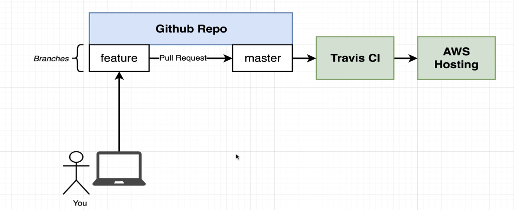

<!-- @import "[TOC]" {cmd="toc" depthFrom=1 depthTo=6 orderedList=false} -->

<!-- code_chunk_output -->

- [Proposed Git hub workflow.](#proposed-git-hub-workflow)
- [🙋 How to run tests on a CI mode in docker explain?](#-how-to-run-tests-on-a-ci-mode-in-docker-explain)
  - [Explanation of `docker run -e CI=true`](#explanation-of-docker-run--e-citrue)
    - [`-e CI=true`](#-e-citrue)
    - [Usage and Purpose](#usage-and-purpose)
    - [Example Usage](#example-usage)
    - [Practical Example](#practical-example)
  - [Summary](#summary)
- [🙋 Explain the below Github actions deployment file to AWS?](#-explain-the-below-github-actions-deployment-file-to-aws)
  - [GitHub Workflow File Explanation](#github-workflow-file-explanation)
    - [Workflow Name](#workflow-name)
    - [Trigger](#trigger)
    - [Jobs](#jobs)
      - [Job Definition](#job-definition)
      - [Steps](#steps)
  - [Summary](#summary-1)
    - [Why Create `deploy.zip`?](#why-create-deployzip)
- [🙋 How to deploy using a container image?](#-how-to-deploy-using-a-container-image)
  - [Steps to Deploy a Docker Image to Elastic Beanstalk](#steps-to-deploy-a-docker-image-to-elastic-beanstalk)
  - [Example Workflow File for Deploying a Docker Image to Elastic Beanstalk](#example-workflow-file-for-deploying-a-docker-image-to-elastic-beanstalk)
  - [Explanation](#explanation)
  - [Elastic Beanstalk Configuration (`option-settings.json`)](#elastic-beanstalk-configuration-option-settingsjson)
  - [Summary](#summary-2)

<!-- /code_chunk_output -->

## Proposed Git hub workflow.


---
## 🙋 How to run tests on a CI mode in docker explain?

### Explanation of `docker run -e CI=true`

The `docker run` command is used to start a new container from a specified image. The `-e` option allows you to set environment variables within the container.

#### `-e CI=true`

- **`-e` Option:** Sets an environment variable inside the container.
- **`CI=true`:** This sets an environment variable named `CI` with the value `true`.

#### Usage and Purpose

Setting `CI=true` is commonly used in the context of Continuous Integration (CI) pipelines. Here's why and how it might be used:

1. **Standard CI Environment Variable:**
   - Many tools and scripts check for the `CI` environment variable to determine if they are running in a CI environment.
   - Setting `CI=true` ensures that the application or script runs in CI mode, which might change its behavior to better suit automated testing and deployment.

2. **Common Adjustments in CI Mode:**
   - **Non-interactive Mode:** Disables interactive prompts and confirmations.
   - **Verbose Logging:** Enables more detailed logging for easier debugging.
   - **Testing Mode:** Some applications might skip certain checks or steps that are unnecessary or redundant in a CI environment.

#### Example Usage

```sh
docker run -e CI=true my-image
```

In this example, a container is started from the `my-image` image, and within this container, the `CI` environment variable is set to `true`.

#### Practical Example

Consider a Node.js application that behaves differently when running in a CI environment:

**package.json:**
```json
{
  "scripts": {
    "test": "echo Running tests... && if [ \"$CI\" = \"true\" ]; then echo Running in CI mode; else echo Running locally; fi"
  }
}
```

**Running the Application:**
```sh
docker run -e CI=true my-node-app npm test
```

**Expected Output:**
```sh
Running tests...
Running in CI mode
```

Without setting `CI=true`, the output would be:
```sh
Running tests...
Running locally
```

### Summary

- **`docker run -e CI=true`:** Sets the `CI` environment variable to `true` inside the container.
- **Purpose:** Indicates the container is running in a CI environment, potentially altering the application's behavior to better suit automated testing and deployment.
- **Usage Example:** `docker run -e CI=true my-image`

---
## 🙋 Explain the below Github actions deployment file to AWS?

```yml
name: Deploy Frontend
on:
  push:
    branches:
      - main

jobs:
  build:
    runs-on: ubuntu-latest
    steps:
      - uses: actions/checkout@v3
      - run: docker login -u ${{ secrets.DOCKER_USERNAME }} -p ${{ secrets.DOCKER_PASSWORD }}
      - run: docker build -t cygnetops/react-test -f Dockerfile.dev .
      - run: docker run -e CI=true cygnetops/react-test npm test

      - name: Generate deployment package
        run: zip -r deploy.zip . -x '*.git*'

      - name: Deploy to EB
        uses: einaregilsson/beanstalk-deploy@v18
        with:
          aws_access_key: ${{ secrets.AWS_ACCESS_KEY }}
          aws_secret_key: ${{ secrets.AWS_SECRET_KEY }}
          application_name: docker-gh
          environment_name: Dockergh-env
          existing_bucket_name: elasticbeanstalk-us-east-1-923445559289
          region: us-east-1
          version_label: ${{ github.sha }}
          deployment_package: deploy.zip
```

### GitHub Workflow File Explanation

The provided GitHub workflow file, `deploy.yaml`, defines an automated deployment process for a frontend application. Here's a breakdown of its contents and the purpose of each step:

#### Workflow Name
```yaml
name: Deploy Frontend
```
- **Name:** Defines the name of the workflow as "Deploy Frontend".

#### Trigger
```yaml
on:
  push:
    branches:
      - main
```
- **Trigger:** This workflow runs on pushes to the `main` branch.

#### Jobs
The workflow contains a single job named `build`.

##### Job Definition
```yaml
jobs:
  build:
    runs-on: ubuntu-latest
```
- **Job Name:** `build`
- **Runs On:** The job runs on the latest Ubuntu runner provided by GitHub Actions.

##### Steps
The job consists of several steps:

1. **Checkout Repository**
   ```yaml
   - uses: actions/checkout@v3
   ```
   - **Action:** Checks out the repository code to the runner.

2. **Login to Docker**
   ```yaml
   - run: docker login -u ${{ secrets.DOCKER_USERNAME }} -p ${{ secrets.DOCKER_PASSWORD }}
   ```
   - **Action:** Logs in to Docker using credentials stored in GitHub secrets.

3. **Build Docker Image**
   ```yaml
   - run: docker build -t cygnetops/react-test -f Dockerfile.dev .
   ```
   - **Action:** Builds a Docker image tagged `cygnetops/react-test` using the `Dockerfile.dev`.

4. **Run Tests**
   ```yaml
   - run: docker run -e CI=true cygnetops/react-test npm test
   ```
   - **Action:** Runs tests in the Docker container with `CI=true` to indicate it's running in a CI environment.

5. **Generate Deployment Package**
   ```yaml
   - name: Generate deployment package
     run: zip -r deploy.zip . -x '*.git*'
   ```
   - **Action:** Creates a `deploy.zip` file containing the entire repository, excluding `.git` files.
   - **Purpose:** The `deploy.zip` is used as the deployment artifact for the Elastic Beanstalk deployment.

6. **Deploy to Elastic Beanstalk**
   ```yaml
   - name: Deploy to EB
     uses: einaregilsson/beanstalk-deploy@v18
     with:
       aws_access_key: ${{ secrets.AWS_ACCESS_KEY }}
       aws_secret_key: ${{ secrets.AWS_SECRET_KEY }}
       application_name: docker-gh
       environment_name: Dockergh-env
       existing_bucket_name: elasticbeanstalk-us-east-1-923445559289
       region: us-east-1
       version_label: ${{ github.sha }}
       deployment_package: deploy.zip
   ```
   - **Action:** Deploys the `deploy.zip` package to AWS Elastic Beanstalk.
   - **Configuration:** Uses AWS credentials and Elastic Beanstalk configuration details stored in GitHub secrets.
   - **Parameters:**
     - `aws_access_key` and `aws_secret_key`: Credentials for AWS access.
     - `application_name`: Name of the Elastic Beanstalk application.
     - `environment_name`: Name of the Elastic Beanstalk environment.
     - `existing_bucket_name`: S3 bucket name used for Elastic Beanstalk.
     - `region`: AWS region.
     - `version_label`: Uses the current commit SHA as the version label.
     - `deployment_package`: Specifies `deploy.zip` as the deployment package.

### Summary

- **Purpose:** Automates the deployment of a frontend application to AWS Elastic Beanstalk.
- **Key Steps:**
  1. Check out the repository.
  2. Log in to Docker.
  3. Build a Docker image.
  4. Run tests in the Docker container.
  5. Generate a `deploy.zip` file.
  6. Deploy the `deploy.zip` file to AWS Elastic Beanstalk.

#### Why Create `deploy.zip`?

- **Packaging:** Bundles the entire application into a single artifact for deployment.
- **Compatibility:** Ensures the deployment process is smooth and the necessary files are transferred to AWS Elastic Beanstalk.
- **Excludes Unnecessary Files:** Excludes `.git` files to keep the deployment package clean and minimal.

---

## 🙋 How to deploy using a container image?

Yes, it is possible to deploy a Docker image directly to AWS Elastic Beanstalk (EBS) without using a zip file. Elastic Beanstalk supports deploying applications as Docker containers. This method involves pushing your Docker image to a container registry (such as Amazon ECR) and configuring Elastic Beanstalk to pull the image from the registry.

### Steps to Deploy a Docker Image to Elastic Beanstalk

1. **Build and Push Docker Image to ECR**
2. **Create or Update Elastic Beanstalk Environment to Use the Docker Image**

### Example Workflow File for Deploying a Docker Image to Elastic Beanstalk

Here's an example GitHub Actions workflow file that builds a Docker image, pushes it to Amazon Elastic Container Registry (ECR), and then updates an Elastic Beanstalk environment to use the new image.

```yaml
name: Deploy to Elastic Beanstalk

on:
  push:
    branches:
      - main

jobs:
  deploy:
    runs-on: ubuntu-latest

    steps:
    - name: Checkout code
      uses: actions/checkout@v3

    - name: Log in to Amazon ECR
      run: |
        aws ecr get-login-password --region us-east-1 | docker login --username AWS --password-stdin <aws_account_id>.dkr.ecr.us-east-1.amazonaws.com

    - name: Build Docker image
      run: |
        docker build -t my-app .
        docker tag my-app:latest <aws_account_id>.dkr.ecr.us-east-1.amazonaws.com/my-app:latest

    - name: Push Docker image to Amazon ECR
      run: |
        docker push <aws_account_id>.dkr.ecr.us-east-1.amazonaws.com/my-app:latest

    - name: Deploy to Elastic Beanstalk
      env:
        AWS_ACCESS_KEY_ID: ${{ secrets.AWS_ACCESS_KEY_ID }}
        AWS_SECRET_ACCESS_KEY: ${{ secrets.AWS_SECRET_ACCESS_KEY }}
        AWS_REGION: us-east-1
      run: |
        aws elasticbeanstalk update-environment --application-name my-app --environment-name my-app-env --version-label latest --option-settings file://option-settings.json
```

### Explanation

1. **Checkout Code:**
   ```yaml
   - name: Checkout code
     uses: actions/checkout@v3
   ```
   - Checks out the repository code.

2. **Log in to Amazon ECR:**
   ```yaml
   - name: Log in to Amazon ECR
     run: |
       aws ecr get-login-password --region us-east-1 | docker login --username AWS --password-stdin <aws_account_id>.dkr.ecr.us-east-1.amazonaws.com
   ```
   - Logs into Amazon ECR using AWS CLI.

3. **Build Docker Image:**
   ```yaml
   - name: Build Docker image
     run: |
       docker build -t my-app .
       docker tag my-app:latest <aws_account_id>.dkr.ecr.us-east-1.amazonaws.com/my-app:latest
   ```
   - Builds and tags the Docker image.

4. **Push Docker Image to Amazon ECR:**
   ```yaml
   - name: Push Docker image to Amazon ECR
     run: |
       docker push <aws_account_id>.dkr.ecr.us-east-1.amazonaws.com/my-app:latest
   ```
   - Pushes the Docker image to Amazon ECR.

5. **Deploy to Elastic Beanstalk:**
   ```yaml
   - name: Deploy to Elastic Beanstalk
     env:
       AWS_ACCESS_KEY_ID: ${{ secrets.AWS_ACCESS_KEY_ID }}
       AWS_SECRET_ACCESS_KEY: ${{ secrets.AWS_SECRET_ACCESS_KEY }}
       AWS_REGION: us-east-1
     run: |
       aws elasticbeanstalk update-environment --application-name my-app --environment-name my-app-env --version-label latest --option-settings file://option-settings.json
   ```
   - Updates the Elastic Beanstalk environment to use the new Docker image.

### Elastic Beanstalk Configuration (`option-settings.json`)

You need to create an `option-settings.json` file that specifies the Docker image to use. Here's an example of what this file might look like:

**`option-settings.json`:**
```json
[
  {
    "Namespace": "aws:elasticbeanstalk:container:docker",
    "OptionName": "ImageUri",
    "Value": "<aws_account_id>.dkr.ecr.us-east-1.amazonaws.com/my-app:latest"
  }
]
```

### Summary

- **Direct Deployment:** You can deploy a Docker image directly to AWS Elastic Beanstalk without using a zip file.
- **Workflow:** The GitHub Actions workflow builds the Docker image, pushes it to Amazon ECR, and updates the Elastic Beanstalk environment.
- **Configuration:** Use `option-settings.json` to specify the Docker image for Elastic Beanstalk.
---