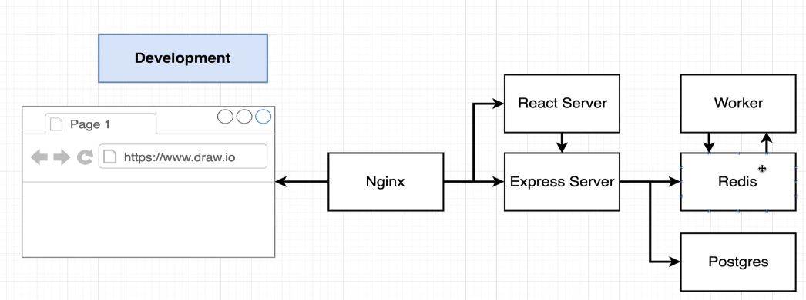
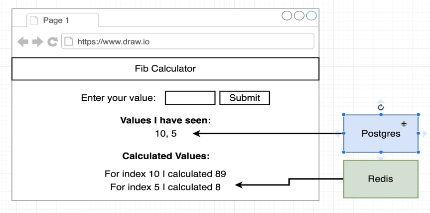
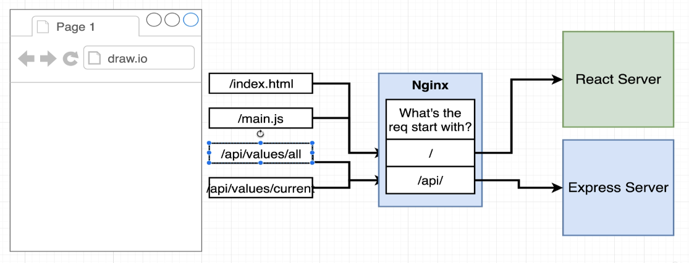
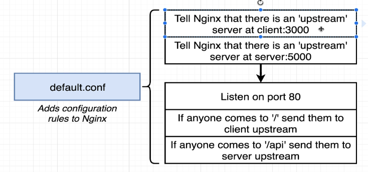

<!-- @import "[TOC]" {cmd="toc" depthFrom=1 depthTo=6 orderedList=false} -->

<!-- code_chunk_output -->

- [🙋 What is the architecture of the simple app we are above to dockerize ?](#-what-is-the-architecture-of-the-simple-app-we-are-above-to-dockerize-)
  - [Simple App Architecture](#simple-app-architecture)
  - [web page design of microservice fetch](#web-page-design-of-microservice-fetch)
  - [Working architecture](#working-architecture)
- [🙋 What does nodemon do which are mentioned in dev scripts for server and worker ?](#-what-does-nodemon-do-which-are-mentioned-in-dev-scripts-for-server-and-worker-)
  - [What is Nodemon Used For?](#what-is-nodemon-used-for)
- [🙋 Why Are Start-Up Commands Different for Client and Express Server in the Dockerfile?](#-why-are-start-up-commands-different-for-client-and-express-server-in-the-dockerfile)
    - [Context:](#context)
    - [Start-Up Commands:](#start-up-commands)
    - [Reasons for Different Commands:](#reasons-for-different-commands)
  - [Summary:](#summary)
- [🙋 Talk about environment settings in a Docker compose file?](#-talk-about-environment-settings-in-a-docker-compose-file)
  - [Setting Environment Variables Inside a Docker Compose File](#setting-environment-variables-inside-a-docker-compose-file)
    - [1. **Directly in the Docker Compose File**](#1-directly-in-the-docker-compose-file)
    - [2. **Using an External Environment File**](#2-using-an-external-environment-file)
    - [3. **Using Environment Variables from the Host**](#3-using-environment-variables-from-the-host)
  - [Key Points:](#key-points)
- [🙋 How is Nginx path routing handled in this project MultiContainer-app  ?](#-how-is-nginx-path-routing-handled-in-this-project-multicontainer-appassets007complex--)
  - [Nginx Path Routing and Port Routing in Docker Compose](#nginx-path-routing-and-port-routing-in-docker-compose)
    - [Nginx Path Routing](#nginx-path-routing)
    - [Benefits of Nginx Path Routing:](#benefits-of-nginx-path-routing)
    - [Why Port Routing is Not Preferred:](#why-port-routing-is-not-preferred)
    - [Summary:](#summary-1)
- [🙋 Explain this default.conf file used to configure Nginx?](#-explain-this-defaultconfassets007complexnginxdefaultconf-file-used-to-configure-nginx)
    - [Overview:](#overview)
    - [Upstream Servers:](#upstream-servers)
    - [Server Block:](#server-block)
    - [Location Blocks:](#location-blocks)
    - [Summary:](#summary-2)
- [🙋 Explain the Dockerfile used to build the Nginx image?](#-explain-the-dockerfileassets007complexnginxdefaultconf-used-to-build-the-nginx-image)
  - [Explanation of the Dockerfile](#explanation-of-the-dockerfile)
    - [Dockerfile Contents:](#dockerfile-contents)
    - [Breakdown:](#breakdown)
  - [Summary:](#summary-3)

<!-- /code_chunk_output -->


---
## 🙋 What is the architecture of the simple app we are above to dockerize ?
### Simple App Architecture


### web page design of microservice fetch



### Working architecture


---

## 🙋 What does nodemon do which are mentioned in dev scripts for server and worker ?
[Server - package.json](assets/007/complex/server/package.json) 
[worker - package.json](assets/007/complex/worker/package.json)

### What is Nodemon Used For?
   - **Nodemon** is a command-line tool used to automatically reload the entire project whenever any source code inside the project changes. It monitors the file system and restarts the application whenever a file is modified. This is particularly useful in a development environment to ensure that any changes made to the code are immediately reflected without manually restarting the application.

---
## 🙋 Why Are Start-Up Commands Different for Client and Express Server in the Dockerfile?
[MultiContainer-app](assets/007/complex) 

#### Context:
- **Client (React Application)** and **Server (Express Application)** are part of a project running in a Dockerized development environment.
- Each service has specific requirements for development, affecting how they are started within Docker.

#### Start-Up Commands:

1. **Client (React Application)**
   - **Command**: `npm start` or similar build tool command.
   - **Purpose**: Starts the development server for the React application.
   - **Details**:
     - Typically uses a build tool (e.g., Create React App) to serve the frontend.
     - Watches for file changes and automatically reloads the browser.
     - Example in Dockerfile:
       ```dockerfile
       CMD ["npm", "start"]
       ```

2. **Server (Express Application)**
   - **Command**: `nodemon` via `npm run dev`.
   - **Purpose**: Starts the Express server with automatic reloads on code changes.
   - **Details**:
     - **Nodemon**: A tool that watches for file changes and restarts the server automatically, enhancing development workflow by eliminating the need to manually restart the server after changes.
     - Example in Dockerfile:
       ```dockerfile
       CMD ["npm", "run", "dev"]
       ```
     - In `package.json`, a `dev` script is defined:
       ```json
       "scripts": {
         "dev": "nodemon index.js"
       }
       ```

#### Reasons for Different Commands:

1. **Different Development Requirements**:
   - **React Client**: Needs a development server to serve and hot-reload frontend assets.
   - **Express Server**: Needs an automatic restart mechanism for server-side code changes.

2. **Tools and Workflows**:
   - **React**: Often uses `webpack-dev-server` or similar tools for development, which includes hot-reloading capabilities.
   - **Express**: Uses `nodemon` to watch for changes and restart the server, ensuring the server reflects the latest code changes immediately.

3. **Efficiency**:
   - **React Client**: Efficiently handles and serves static assets, providing instant feedback on changes.
   - **Express Server**: Ensures the server is always running the latest code without manual intervention, improving development speed and accuracy.

### Summary:
The start-up commands differ because the client and server have distinct roles and requirements in the development process. The React client uses `npm start` to leverage a development server with hot-reloading, while the Express server uses `nodemon` (via `npm run dev`) to automatically restart the server on code changes, enhancing the development workflow for both frontend and backend.

---
## 🙋 Talk about environment settings in a Docker compose file?
### Setting Environment Variables Inside a Docker Compose File

Environment variables in a Docker Compose file can be used to configure various aspects of the services defined in the file. These variables can be specified directly in the Compose file, or they can be loaded from an external file. Here's a detailed explanation with examples.

#### 1. **Directly in the Docker Compose File**

You can set environment variables directly within the service definitions in the `docker-compose.yml` file using the `environment` key.

**Example**:
```yaml
version: '3.8'

services:
  web:
    image: node:14
    environment:
      - NODE_ENV=development
      - PORT=3000
    ports:
      - "3000:3000"
    volumes:
      - .:/app
      - /app/node_modules
    command: npm start

  db:
    image: postgres:13
    environment:
      - POSTGRES_DB=mydatabase
      - POSTGRES_USER=myuser
      - POSTGRES_PASSWORD=mypassword
    volumes:
      - db-data:/var/lib/postgresql/data

volumes:
  db-data:
```

In this example:
- The `web` service sets `NODE_ENV` and `PORT` environment variables.
- The `db` service sets `POSTGRES_DB`, `POSTGRES_USER`, and `POSTGRES_PASSWORD` environment variables.

#### 2. **Using an External Environment File**

You can also specify environment variables in a separate `.env` file and reference this file from your Docker Compose file.

**Example of `.env` file**:
```
NODE_ENV=development
PORT=3000
POSTGRES_DB=mydatabase
POSTGRES_USER=myuser
POSTGRES_PASSWORD=mypassword
```

**docker-compose.yml**:
```yaml
version: '3.8'

services:
  web:
    image: node:14
    env_file:
      - .env
    ports:
      - "${PORT}:${PORT}"
    volumes:
      - .:/app
      - /app/node_modules
    command: npm start

  db:
    image: postgres:13
    env_file:
      - .env
    volumes:
      - db-data:/var/lib/postgresql/data

volumes:
  db-data:
```

In this setup:
- The `.env` file contains all the environment variables.
- The `env_file` key in the Compose file references this `.env` file, making the variables available to the services.

#### 3. **Using Environment Variables from the Host**

Docker Compose can also use environment variables defined on the host machine. You can reference these host variables using the `${VARIABLE_NAME}` syntax.

**Example**:
```yaml
version: '3.8'

services:
  web:
    image: node:14
    environment:
      - NODE_ENV=${NODE_ENV}
      - PORT=${PORT}
    ports:
      - "${PORT}:${PORT}"
    volumes:
      - .:/app
      - /app/node_modules
    command: npm start

  db:
    image: postgres:13
    environment:
      - POSTGRES_DB=${POSTGRES_DB}
      - POSTGRES_USER=${POSTGRES_USER}
      - POSTGRES_PASSWORD=${POSTGRES_PASSWORD}
    volumes:
      - db-data:/var/lib/postgresql/data

volumes:
  db-data:
```

In this example:
- The `web` and `db` services use environment variables defined on the host machine.
- The syntax `${VARIABLE_NAME}` references the corresponding host environment variables.

### Key Points:
- **Direct Method**: Use the `environment` key within the service definition to set variables directly.
- **External File Method**: Use the `env_file` key to load variables from an external `.env` file.
- **Host Environment Variables**: Use the `${VARIABLE_NAME}` syntax to reference host machine environment variables.

By using these methods, you can flexibly configure your Docker services with the necessary environment variables, making your setup more manageable and portable.

---

## 🙋 How is Nginx path routing handled in this project [MultiContainer-app](assets/007/complex)  ?


### Nginx Path Routing and Port Routing in Docker Compose

#### Nginx Path Routing
- **Purpose**: Nginx acts as a reverse proxy to route requests to appropriate backend services based on the request path.
- **Configuration**:
  - Requests with `/API` are routed to the Express server.
  - Other requests are routed to the React server.
- **Example**:
  - `GET /API/values` -> Nginx -> Express server (handles API requests).
  - `GET /index.html` or `GET /main.js` -> Nginx -> React server (handles static files and frontend).

#### Benefits of Nginx Path Routing:
- **Centralized Routing**: Nginx handles all incoming requests and routes them appropriately without exposing multiple ports.
- **Simplified Client Requests**: Clients make requests to a single endpoint (e.g., `http://example.com`) without needing to specify different ports.
- **Consistent URLs**: Use consistent request patterns (e.g., `/API`) without worrying about dynamic port changes.

#### Why Port Routing is Not Preferred:
- **Port Management Complexity**:
  - Different services (React, Express) would require different ports (e.g., 3000 for React, 4000 for Express).
  - In production, ports might change frequently due to various deployment configurations.
- **Client-Side Convenience**:
  - Clients would need to manage and specify different ports for different services (e.g., `http://example.com:3000` for React, `http://example.com:4000` for Express).
  - This is cumbersome and prone to errors, especially when ports change.
- **Scalability and Maintainability**:
  - Centralizing requests through Nginx makes scaling and maintaining the application easier.
  - Nginx can handle SSL termination, load balancing, and other advanced routing features.

#### Summary:
Using Nginx for path-based routing simplifies the development and production environments by centralizing request handling and avoiding the complexity of managing multiple ports. This approach ensures that requests are consistently routed to the correct backend service based on the URL path, providing a seamless experience for clients and reducing the potential for configuration errors.

---
## 🙋 Explain this [default.conf](assets/007/complex/nginx/default.conf) file used to configure Nginx?

#### Overview:
The `default.conf` file configures an Nginx server to act as a reverse proxy, routing incoming requests to appropriate backend services based on the request path. Here’s a breakdown of the configuration:

#### Upstream Servers:
- **Upstream Blocks**: Define backend services for Nginx to forward requests.
  ```nginx
  upstream client {
    server client:3000;
  }

  upstream api {
    server api:5000;
  }
  ```
  - **client**: Refers to the React client application running on port 3000.
  - **api**: Refers to the Express API server running on port 5000.

#### Server Block:
- **Server Block**: Configures the Nginx server to listen on port 80 and route requests based on the URL path.
  ```nginx
  server {
    listen 80;
  ```

#### Location Blocks:
- **Root Location (`/`)**:
  ```nginx
    location / {
      proxy_pass http://client;
    }
  ```
  - **Purpose**: Routes all requests to the root (`/`) to the React client application.
  - **proxy_pass**: Forwards these requests to the `client` upstream server.

- **WebSocket Location (`/ws`)**:
  ```nginx
    location /ws {
        proxy_pass http://client;
        proxy_http_version 1.1;
        proxy_set_header Upgrade $http_upgrade;
        proxy_set_header Connection "Upgrade";
    }
  ```
  - **Purpose**: Handles WebSocket connections, typically required for real-time features.
  - **proxy_http_version 1.1**: Uses HTTP/1.1 for WebSocket support.
  - **proxy_set_header Upgrade $http_upgrade**: Sets the `Upgrade` header to handle WebSocket protocol.
  - **proxy_set_header Connection "Upgrade"**: Sets the `Connection` header to `Upgrade`.

- **API Location (`/api`)**:
  ```nginx
    location /api {
      rewrite /api/(.*) /$1 break;
      proxy_pass http://api;
    }
  ```
  - **Purpose**: Routes API requests to the Express server.
  - **rewrite /api/(.*) /$1 break**: Removes the `/api` prefix from the request path before forwarding it to the API server. This ensures the API server receives the correct endpoint.
  - **proxy_pass**: Forwards these requests to the `api` upstream server.

#### Summary:
- **Upstream Configuration**: Defines backend services for the React client and Express API.
- **Root Path (`/`)**: Routes to the React client.
- **WebSocket Path (`/ws`)**: Special handling for WebSocket connections to the React client.
- **API Path (`/api`)**: Routes to the Express API server, with path rewriting to remove the `/api` prefix.

This configuration ensures that:
- Standard web requests go to the React frontend.
- WebSocket connections are properly handled.
- API requests are routed to the backend server with the correct path.

---
## 🙋 Explain the [Dockerfile](assets/007/complex/nginx/default.conf) used to build the Nginx image?

### Explanation of the Dockerfile

#### Dockerfile Contents:
```dockerfile
FROM nginx
COPY ./default.conf /etc/nginx/conf.d/default.conf
```

#### Breakdown:
1. **FROM nginx**:
   - **Purpose**: Specifies the base image for the Docker container.
   - **nginx**: This indicates that the base image is the official Nginx image from Docker Hub. It includes Nginx installed and ready to use.

2. **COPY ./default.conf /etc/nginx/conf.d/default.conf**:
   - **Purpose**: Copies a custom Nginx configuration file into the container.
   - **Source (`./default.conf`)**: Refers to the `default.conf` file located in the same directory as the Dockerfile on the host machine.
   - **Destination (`/etc/nginx/conf.d/default.conf`)**: The path inside the Nginx container where the configuration file will be placed.
     - **/etc/nginx/conf.d/**: This directory is where Nginx looks for additional configuration files to include in its main configuration.

### Summary:
This Dockerfile sets up an Nginx server with a custom configuration by copying a specified `default.conf` file into the container. This approach ensures consistent and automated setup of Nginx with the desired routing and proxy configurations, facilitating easier deployment and management of web applications.