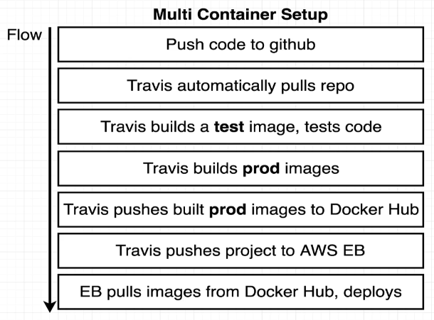

<!-- @import "[TOC]" {cmd="toc" depthFrom=1 depthTo=6 orderedList=false} -->

<!-- code_chunk_output -->

- [🙋 Why do we need 2 Dockerfiles: one Dockerfile.dev and one Dockerfile in the Repo?](#-why-do-we-need-2-dockerfiles-one-dockerfiledev-and-one-dockerfile-in-the-repo)
  - [Development vs. Production](#development-vs-production)
  - [Optimized Image Size](#optimized-image-size)
  - [Separation of Concerns](#separation-of-concerns)
  - [CI/CD](#cicd)
  - [Flexibility and Customization](#flexibility-and-customization)
- [🙋 Discuss the Differences in Dockerfile and Dockerfile.dev for each services in Multicontainer_project?](#-discuss-the-differences-in-dockerfile-and-dockerfiledev-for-each-services-in-multicontainer_projectdockerassets008complex-gh)
  - [Client Service](#client-service)
  - [External Nginx Service](#external-nginx-service)
  - [Server Service and Workers Service](#server-service-and-workers-service)
- [🙋 Why are there 2 Nginx Services in the production version of the setup?](#-why-are-there-2-nginx-services-in-the-production-version-of-the-setup)
- [🙋 What are the difference between Routing and Serving Nginx configurations.](#-what-are-the-difference-between-routing-and-serving-nginx-configurations)
- [🙋 Discuss how the Routing and serving Nginx configurations are different?](#-discuss-how-the-routing-and-serving-nginx-configurations-are-different)
  - [Differences Between Routing and Serving Nginx Configurations](#differences-between-routing-and-serving-nginx-configurations)
  - [Example Routing Nginx Configuration:](#example-routing-nginx-configuration)
  - [Example Serving Nginx Configuration:](#example-serving-nginx-configuration)
- [🙋 Discuss how the deploy.yaml is used to follow the multicontainer deployment process shown below ?](#-discuss-how-the-deployyamldockerassets008complex-ghgithubworkflowsdeployyaml-is-used-to-follow-the-multicontainer-deployment-process-shown-below-)
    - [Overview:](#overview)
    - [Step-by-Step Breakdown:](#step-by-step-breakdown)
  - [Summary:](#summary)
  - [Additional Notes:](#additional-notes)

<!-- /code_chunk_output -->


---

## 🙋 Why do we need 2 Dockerfiles: one Dockerfile.dev and one Dockerfile in the Repo?

### Development vs. Production

- **Dockerfile.dev**: Provides a development-friendly environment with tools like live reloading and debugging.
- **Dockerfile**: Optimized for performance and security, stripped of unnecessary development tools.

### Optimized Image Size

- **Dockerfile**: Optimized for smaller image size using multi-stage builds and minimizing layers.
- **Dockerfile.dev**: Includes additional development tools, which result in a larger image size.

### Separation of Concerns

- Promotes better organization and maintainability of the codebase.
- Allows developers to work in a development-friendly environment without affecting production.

### CI/CD

- **Dockerfile**: Used to build the production image for deployment.
- **Dockerfile.dev**: Used for running tests or development-related tasks during CI/CD processes.

### Flexibility and Customization

- Allows for greater flexibility in customizing build processes and configurations for different environments.
- Developers can modify Dockerfile.dev without affecting production settings, and vice versa.

## 🙋 Discuss the Differences in Dockerfile and Dockerfile.dev for each services in [Multicontainer_project](Docker/assets/008/complex-gh)?

### Client Service
| Aspect | Dockerfile.dev | Dockerfile |
|--------|----------------|------------|
| **Base Image** | - Uses `node:16-alpine` as the base image for the development environment. | - Uses a multi-stage build with two base images:<br>1. `node:16-alpine` for building the application.<br>2. `nginx` for serving the built files in production. |
| **Build Process** | - Copies the entire client directory into the container.<br>- Installs the dependencies using `npm install`.<br>- Starts the development server with `npm run start`.<br>- Suitable for development as it allows for live reloading and a faster development workflow. | - Utilizes a multi-stage build process:<br>1. Copies the necessary files (`package.json` and the entire client directory) into the `builder` stage.<br>2. Installs the dependencies using `npm install`.<br>3. Builds the application using `npm run build`.<br>4. Copies the built files from the `builder` stage to the `nginx` stage for serving.<br>- Optimizes the production build by only including the necessary files in the final image. |
| **Exposed Ports** | - No ports are explicitly exposed in the `Dockerfile.dev`. | - Exposes port 3000 for the Nginx server.<br>- Allows accessing the production application from the host machine. |
| **Command** | - Specifies the command `npm run start` to start the development server.<br>- Runs the application in development mode with live reloading. | - Does not specify a command.<br>- Relies on the default command of the `nginx` image to serve the built files. |
| **Summary** | The `Dockerfile.dev` is optimized for development purposes, providing a lightweight environment with live reloading and a faster development workflow. It copies the entire client directory, installs dependencies, and starts the development server. No ports are explicitly exposed in the `Dockerfile.dev`. | The `Dockerfile` is designed for production use. It utilizes a multi-stage build process to create a smaller final image. It copies only the necessary files, installs dependencies, builds the application, and copies the built files to the Nginx stage for serving. The exposed port 3000 is used by the Nginx server to serve the application. The command is not specified as it relies on the default Nginx command to serve the files. |

### External Nginx Service

| Aspect | Dockerfile/Dockerfile.dev (both are same) |
|--------|------------|
| **Base Image** | - Uses the `nginx` base image, which provides a pre-configured Nginx server. |
| **Configuration** | - Copies the `default.conf` file from the local directory to `/etc/nginx/conf.d/default.conf` inside the container.<br>- The `default.conf` file contains the Nginx server configuration, specifying how requests should be handled and routed. |
| **Exposed Ports** | - The `Dockerfile` does not explicitly expose any ports.<br>- However, the `default.conf` file may specify the ports on which Nginx should listen for incoming requests. |
| **Command** | - The `Dockerfile` does not specify a command.<br>- It relies on the default command provided by the `nginx` base image, which starts the Nginx server. |
| **Summary** | The `Dockerfile` for the `nginx` service is used for both development and production environments. It utilizes the `nginx` base image and copies the `default.conf` file to configure the Nginx server. The `Dockerfile` itself does not expose any ports or specify a command, as it relies on the default behavior of the `nginx` base image to start the server.<br><br>The `default.conf` file contains the necessary configuration for the Nginx server, specifying how requests should be handled and routed. This allows the `nginx` service to act as a reverse proxy, forwarding requests to the appropriate backend services based on the defined rules.<br><br>By having a single `Dockerfile` for both development and production, the `nginx` service maintains consistency in its configuration and behavior across different environments. |

### Server Service and Workers Service

| Aspect | Dockerfile.dev | Dockerfile |
|--------|----------------|------------|
| **Base Image** | Uses `node:16-alpine` as the base image for the development environment. | Uses `node:16-alpine` as the base image for the production environment. |
| **Build Process** | 1. Set the working directory to `/app`.<br>2. Copy `package.json` to the working directory.<br>3. Run `npm install` to install dependencies.<br>4. Copy the rest of the application code to the working directory. | 1. Set the working directory to `/app`.<br>2. Copy `package.json` to the working directory.<br>3. Run `npm install` to install dependencies.<br>4. Copy the rest of the application code to the working directory. |
| **Exposed Ports** | Does not explicitly expose any ports. | Does not explicitly expose any ports. |
| **Command** | Specifies the command `npm run dev` to start the server using nodemon for development. | Specifies the command `npm run start` to start the server for production. |
| **Summary** | The `Dockerfile.dev` for the `server and worker` service is used for development purposes. It sets up the environment, installs dependencies, and starts the server with nodemon for live reloading. | The `Dockerfile` for the `server and worker` service is used for production. It sets up the environment, installs dependencies, and starts the server. |

## 🙋 Why are there 2 Nginx Services in the production version of the setup?

1. **Two Nginx Services**:
   - **Routing Nginx**: Handles all incoming requests, routes them to appropriate backend services.
   - **Serving Nginx**: Dedicated to serving the production React files.

2. **Purposes**:
   - **Routing Nginx**:
     - Acts as the entry point for all requests.
     - Listens on **port 80**, where routes requests to backend services like the Express server or the React server.
     - Ensures that API requests and requests for static files are directed to the correct service.
   - **Serving Nginx**:
     - Specifically serves the production version of the React application.
     - Listens on **port 3000**, serving static assets efficiently.
     - Is accessed through the Routing Nginx, ensuring a streamlined flow for serving frontend assets.

3. **Reasons for Two Nginx Instances**:
   - **Separation of Concerns**:
     - Keeps routing logic and static file serving separate.
     - Allows for easier maintenance and scalability.
   - **Flexibility**:
     - Accommodates different configurations or services that might replace Nginx in the future.
     - Prepares for real-world scenarios where different services might handle routing and file serving.
   - **Production Readiness**:
     - Reflects a more complex and realistic production setup.
     - Provides robustness by having dedicated services for specific tasks.

This documentation compares the differences between the Routing and Serving Nginx configurations. The Routing Nginx configuration is responsible for handling the routing of requests to the appropriate backend services, while the Serving Nginx configuration is responsible for serving the static files for the React application.

## 🙋 What are the difference between Routing and Serving Nginx configurations.
The key differences between the two configurations are:

- **Purpose**: The Routing Nginx configuration handles routing of requests to the backend services, while the Serving Nginx configuration serves the static files for the React application.
- **Listen Port**: The Routing Nginx configuration listens on port 80, while the Serving Nginx configuration listens on port 3000.
- **Root Path Handling**: The Routing Nginx configuration proxies the root path (`/`) to the `client` group, while the Serving Nginx configuration serves the static files from the `/usr/share/nginx/html` directory and uses the `try_files` directive to handle client-side routing.
- **API Requests**: The Routing Nginx configuration handles API requests by rewriting the URL path and proxying the request to the `api` group, while the Serving Nginx configuration does not handle API requests.
- **WebSocket Handling**: The Routing Nginx configuration handles WebSocket requests by proxying them to the `client` group and setting the necessary headers, while the Serving Nginx configuration does not handle WebSocket requests.
This documentation provides an overview of the differences between the Routing and Serving Nginx configurations, as well as example configurations for each.

The Routing Nginx configuration is responsible for handling the routing of requests to the appropriate backend services. It listens on port 80 (HTTP) and proxies requests to the `client` and `api` application groups. The configuration includes specific handling for WebSocket requests and API requests.

The Serving Nginx configuration is responsible for serving the static files for the React application. It listens on port 3000 and serves the HTML files located in the `/usr/share/nginx/html` directory. The `try_files` directive ensures that if a requested file or directory does not exist, Nginx will attempt to serve the `/index.html` file instead, which is useful for single-page applications that rely on client-side routing.
## 🙋 Discuss how the Routing and serving Nginx configurations are different?


### Differences Between Routing and Serving Nginx Configurations

| Feature                 | Routing Nginx Configuration                                                                                                  | Serving Nginx Configuration                                                                                                   |
|-------------------------|------------------------------------------------------------------------------------------------------------------------------|-------------------------------------------------------------------------------------------------------------------------------|
| **Purpose**             | Handle routing of requests to appropriate backend services.                                                                 | Serve static files for the React application.                                                                                 |
| **Listen Port**         | `listen 80;`                                                                                                                 | `listen 3000;`                                                                                                                |
| **Root Path Handling**  | `location / { proxy_pass http://client; }`                                                                                   | `location / { root /usr/share/nginx/html; index index.html index.htm; try_files $uri $uri/ /index.html; }`                    |
| **API Requests**        | `location /api { rewrite /api/(.*) /$1 break; proxy_pass http://api; }`                                                      | Not applicable.                                                                                                               |
| **WebSocket Handling**  | `location /ws { proxy_pass http://client; proxy_http_version 1.1; proxy_set_header Upgrade $http_upgrade; proxy_set_header Connection "Upgrade"; }` | Not applicable.                                                                                                               |

### Example Routing Nginx Configuration:
```nginx
#This Nginx configuration file sets up a reverse proxy for a client application and an API application.
#The `upstream` blocks define two server groups: `client` and `api`. The `client` group points to the client application running on port 3000, and the `api` group points to the API application running on port 5000.
#The `server` block listens on port 80 (HTTP) and handles the following routes:

    #- `/`: Proxies requests to the `client` group.
    #- `/ws`: Proxies WebSocket requests to the `client` group, setting the necessary headers for WebSocket communication.
    #- `/api`: Rewrites the URL path to remove the `/api` prefix and proxies the request to the `api` group.


upstream client {
  server client:3000;
}

upstream api {
  server api:5000;
}

server {
  listen 80;

  location / {
    proxy_pass http://client;
  }

  location /ws {
    proxy_pass http://client;
    proxy_http_version 1.1;
    proxy_set_header Upgrade $http_upgrade;
    proxy_set_header Connection "Upgrade";
  }

  location /api {
    rewrite /api/(.*) /$1 break;
    proxy_pass http://api;
  }
}
```

### Example Serving Nginx Configuration:
```nginx
#This Nginx server configuration block listens on port 3000 and serves the static HTML #files located in the `/usr/share/nginx/html` directory.
    # - The `try_files` directive ensures that if a requested file or directory does not exist,
    # - Nginx will attempt to serve the `/index.html` file instead,
    # - which is useful for single-page applications that rely on client-side routing.

server {
  listen 3000;

  location / {
    root /usr/share/nginx/html; 
    index index.html index.htm; 
    try_files $uri $uri/ /index.html; 
  }
}
```

---
## 🙋 Discuss how the [deploy.yaml](Docker/assets/008/complex-gh/.github/workflows/deploy.yaml) is used to follow the multicontainer deployment process shown below ?



#### Overview:
The `deploy.yaml` file configures GitHub Actions to automate the deployment of a multi-container application, aligning with the flow illustrated in the provided image for Travis CI.

#### Step-by-Step Breakdown:

1. **Push Code to GitHub**:
   - The deployment process is triggered by a push to the `main` branch.
   ```yaml
   on:
     push:
       branches:
         - main
   ```

2. **GitHub Actions Pulls Repo**:
   - GitHub Actions automatically pulls the repository once code is pushed.
   ```yaml
   jobs:
     build:
       runs-on: ubuntu-latest
       steps:
         - uses: actions/checkout@v3
   ```

3. **Build a Test Image and Test Code**:
   - A Docker image for testing is built using `Dockerfile.dev` and tests are run.
   ```yaml
         - run: docker login -u ${{ secrets.DOCKER_USERNAME }} -p ${{ secrets.DOCKER_PASSWORD }}
         - run: docker build -t rallycoding/react-test -f ./client/Dockerfile.dev ./client
         - run: docker run -e CI=true rallycoding/react-test npm test
   ```

4. **Build Production Images**:
   - Production Docker images are built for each service: client, Nginx, server, and worker.
   ```yaml
         - run: docker build -t rallycoding/multi-client ./client
         - run: docker build -t rallycoding/multi-nginx ./nginx
         - run: docker build -t rallycoding/multi-server ./server
         - run: docker build -t rallycoding/multi-worker ./worker
   ```

5. **Push Built Production Images to Docker Hub**:
   - The built production images are pushed to Docker Hub.
   ```yaml
         - run: docker push rallycoding/multi-client
         - run: docker push rallycoding/multi-nginx
         - run: docker push rallycoding/multi-server
         - run: docker push rallycoding/multi-worker
   ```

6. **GitHub Actions Pushes Project to AWS EB**:
   - Although the provided `deploy.yaml` does not include the steps for deploying to AWS Elastic Beanstalk (EB), this step would typically involve additional steps to deploy the Docker images to AWS EB.

7. **EB Pulls Images from Docker Hub and Deploys**:
   - AWS Elastic Beanstalk would pull the images from Docker Hub and deploy them, completing the deployment process.

### Summary:
- **Trigger**: The workflow is triggered by a push to the `main` branch.
- **Build and Test**: A test image is built and tests are run to ensure the code is working as expected.
- **Build Production Images**: Production images for all services are built.
- **Push to Docker Hub**: These images are then pushed to Docker Hub.

### Additional Notes:
- To fully align with the flow in the image, steps for deploying the project to AWS Elastic Beanstalk should be included in the `deploy.yaml` file. This typically involves using the AWS CLI or an AWS GitHub Action to deploy the Docker images.

---